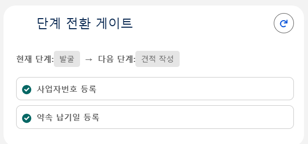
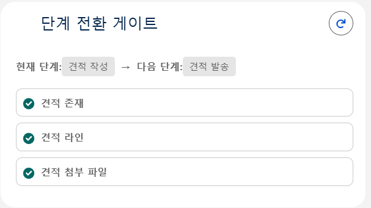
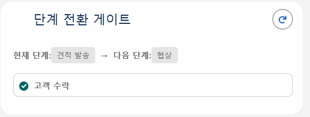
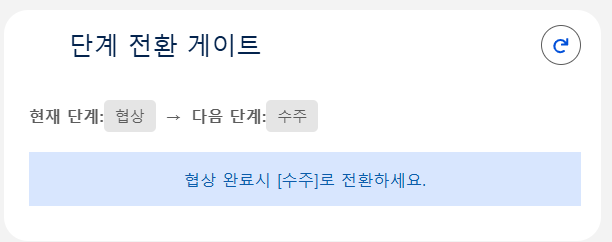

# Sales Cockpit — 한도정밀 L2C 자동화 시스템

> **Lead-to-Cash 영업 풀사이클을 한 화면으로.**
> Salesforce 위에서 Flow · Apex · LWC · Prompt Builder · Agentforce 5종 기술을 엮어,
> 영업 사원이 발굴부터 수금까지 화면을 옮기지 않고 처리하도록 만든 영업 워크스페이스 데모입니다.


| | |
| --- | --- |
| **고객사 (가상)** | 한도정밀 — B2B 정밀 부품·소재 제조 (Make-to-Order) |
| **대표 페르소나** | AE 김민수 · 영업 5년차 |
| **작업 기간** | 2026-05-07 ~ 2026-05-13 (약 7일) · 발표 2026-05-14 |
| **타깃 Org** | Agentforce DE Org · API v66.0 |
| **외부 통신** | 0건 — ERP·OCR 모두 내부 Mock 또는 Prompt Builder |

> 한도정밀, 페르소나, 거래 데이터는 모두 발표 시연용 가상 사례입니다.

---

## 목차

1. [프로젝트 개요](#1-프로젝트-개요)
2. [데모 — 시연 영상](#2-데모--시연-영상)
3. [대상 사용자 — AE 김민수](#3-대상-사용자--ae-김민수)
4. [As-is / To-be 매트릭스](#4-as-is--to-be-매트릭스)
5. [핵심 가치 4가지](#5-핵심-가치-4가지)
6. [설계 원칙 3가지](#6-설계-원칙-3가지)
7. [주요 기능 5건](#7-주요-기능-5건)
8. [기술 스택 & 메타데이터 규모](#8-기술-스택--메타데이터-규모)
9. [디렉토리 구조](#9-디렉토리-구조)
10. [빌드 / 배포](#10-빌드--배포)
11. [회고](#11-회고)

---

## 1. 프로젝트 개요

한도정밀은 국내 중견 기계·장비 제조사에 정밀 부품·소재를 가공·표면처리 일관 생산하여 공급하는 **B2B 제조 기업**입니다. 건당 수천만 원 단위의 수주형 거래(MTO)가 중심이며, **납기 약속과 현금 흐름 관리**가 곧 신뢰의 척도입니다.

이 프로젝트는 메일·엑셀·메신저·ERP에 흩어진 영업 작업을 **Lead → Opportunity → Quote → Order → Cash** 단일 흐름으로 통합합니다. 입력의 대부분은 AI가 자동으로 추출하고, AE는 단가·승인·납기 협상 같은 의사결정에 집중합니다.

```
 ┌─ 01 LEAD ──┐   ┌─ 02 OPP ───┐   ┌─ 03 QUOTE ─┐   ┌─ 04 ORDER ─┐   ┌─ 06 CASH ──┐
 │   발굴      │ → │  영업 기회  │ → │   견적      │ → │   주문      │ → │   수금      │
 │ 3채널 인입  │   │ 사업자 OCR  │   │ PDF·재견적  │   │ 자동 생성   │   │ 분할 입금   │
 │ 메모 AI추출 │   │ 단계 게이트 │   │ 의도 분류   │   │ 납기 승계   │   │ 미수금 알림 │
 └────────────┘   └────────────┘   └────────────┘   └─────┬──────┘   └────────────┘
                                                    05 ERP 납기 갭 (Mock)
```

---

## 2. 데모 — 시연 영상

화면증적 영상은 [`docs/videos/`](docs/videos/)에 포함되어 있습니다. GitHub에서 링크를 클릭하면 내장 플레이어로 재생됩니다.

### 전체 흐름

| 영상 | 길이 | 내용 |
| --- | --- | --- |
| [▶ 전체 데모 (A–Z)](docs/videos/full-demo.mp4) | 4:28 | Lead 발굴부터 수금 알림까지 L2C 5단계 통합 시나리오 |
| [▶ 기본 프로세스 1–7](docs/videos/process-overview.mp4) | 4:19 | 단계별 핵심 동작을 순서대로 훑는 개요 영상 |

### 단계별 시연

| # | 영상 | 길이 | 대응 기능 |
| --- | --- | --- | --- |
| 01 | [▶ 리드 → 견적](docs/videos/01-lead-to-quote.mp4) | 1:38 | 기능 1·2 — Lead 인입 / 사업자등록증 OCR |
| 02 | [▶ 견적 제품 추가 + 이메일 발송](docs/videos/02-quote-line-and-email.mp4) | 0:49 | 기능 3 — 견적 작성 / PDF 발송 |
| 03 | [▶ 견적 거절 (의도 분류)](docs/videos/03-quote-rejection.mp4) | 0:24 | 기능 3 — 응답 메일 의도 분류 |
| 04 | [▶ 견적 재생성](docs/videos/04-quote-regeneration.mp4) | 0:45 | 기능 3 — 재견적 자동 초안 |
| 05 | [▶ 기회 수주](docs/videos/05-opportunity-won.mp4) | 0:13 | 기능 4 — 수주 전환 |
| 06 | [▶ 주문 자동 생성](docs/videos/06-order-auto-create.mp4) | 0:26 | 기능 4 — Order 자동 INSERT |
| 07 | [▶ ERP 동기화](docs/videos/07-erp-sync.mp4) | 0:04 | 기능 4 — ERP 갭 보고 |
| 08 | [▶ 부분 입금](docs/videos/08-partial-payment.mp4) | 0:09 | 기능 1·6 — 분할 입금 / 미수금 추적 |

📊 발표 슬라이드 전체본: [`한도정밀 L2C 발표_최종본.html`](한도정밀%20L2C%20발표_최종본.html) (29페이지)

---

## 3. 대상 사용자 — AE 김민수

> **"AE 김민수, 오늘도 네 곳을 오갑니다."**
> 한도정밀 영업 5년차. 메일·엑셀·메신저·ERP — 매일 네 가지 도구를 오가며 우선순위를 손으로 정렬합니다.

| 경력 | 담당 고객사 | 진행 견적 | 분기 목표 |
| --- | --- | --- | --- |
| 5년차 | 38사 | 14건 | ₩ 1.8B |

| 하루 평균 메일 | 하루 ERP 진입 | 아침 우선순위 정렬 | 정보 출처 |
| --- | --- | --- | --- |
| 42건 | 9회 | ~30분 | 4곳 분산 |

**해결 대상 Pain Points**

| | 문제 | 본 시스템의 해결 |
| --- | --- | --- |
| **P1** | 견적 라인 복사·주문 생성·메일 분류 등 반복 업무를 매번 수동 처리 | L2C 자동화 (기능 4) |
| **P2** | 단계별 가이드 부재 — "다음에 무엇을 채워야 하는지" 시스템이 안내하지 않음 | 단계 게이트 (기능 5) |
| **P3** | 파이프라인·견적·주문·미수금이 모두 다른 화면에 흩어져 있음 | 영업 콕피트 (기능 1) |
| **P4** | 장기 미수금 식별·분할 입금 추적을 영업이 직접 챙겨야 함 | 미수금 카드 + 입금 등록 (기능 1·6) |

---

## 4. As-is / To-be 매트릭스

| # | 영역 | As-is — 현재 비효율 | To-be — 개선안 |
| --- | --- | --- | --- |
| 01 | 정보 분산 | 네 도구를 오가며 "오늘 무엇이 급한지" 사람이 직접 정렬. 아침마다 ~30분 소요 | 콕피트 5카드 + 자연어 입력바로 한 화면에서 묻고 답을 받음 |
| 02 | 사업자 정보 입력 | 사업자등록증을 보며 4필드를 한 글자씩 손으로 입력. 오타 시 세금계산서 단계까지 거슬러 수정 | 사업자등록증 이미지 한 장 업로드 → 4필드 자동 보강 |
| 03 | 재견적 재작성 | "5% 인하해 주세요" 한 줄 회신에도 동일 품목·수량을 처음부터 다시 입력 | 응답 메일 의도 분류 → 라인 복제 + 협상 메모 자동 합성, AE 검토 후 확정 |
| 04 | L2C 단계 점프 | 견적 수락 후 ERP·주문·납기 정보를 사람이 다시 옮겨 적음 | 수락 시 라인 자동 복사, 수주 시 주문 자동 생성, 약속 납기일 자동 승계 |
| 05 | 느슨한 단계 전환 | 사업자번호 없이 견적, 라인 없는 견적 발송 등 — 명목 단계만 있고 게이트 없음 | 3개 게이트가 전환을 자동 점검하고 미충족 조건을 인라인 안내 |

---

## 5. 핵심 가치 4가지

| | 가치 | 설명 |
| --- | --- | --- |
| **01** | **L2C 단일 흐름** | Lead → Opp → Quote → Order → Cash가 한 플랫폼에서 같은 ID로 흐름. 단계 간 정보 점프 없음 |
| **02** | **AI 보조, AE 의사결정** | AI는 추출·분류·합성을 수행하고, 단가·할인·승인 같은 가격 결정은 AE가 처리. 초안은 항상 사람이 한 번 더 확인 |
| **03** | **한 화면 콕피트 UX** | 우선 Lead · 위험 주문 · 견적 추적 · 미수금 · 파이프라인 5가지 우선순위를 한 화면에 모음 |
| **04** | **한국 B2B 최적화** | 사업자번호·대표자·법인명 자동 추출, ₩ + 일금 한글 표기, 한국식 견적 PDF, 한국어 자연체 응답 |

---

## 6. 설계 원칙 3가지

모든 기능에 일관 적용한 세 가지 원칙입니다.

1. **한국 비즈니스 정서** — 입력·출력의 어휘와 형식이 한국 영업 관행에 맞음. 사업자번호·대표자·법인명, ₩ + 일금 한글, 한국식 견적 PDF, 한국어 자연체 응답.
2. **AE 의사결정 중심** — AI는 추출·분류·합성만. 가격·할인·승인·납기 협상은 AE가 직접. AI 판단은 항상 "초안"으로 표시되어 검토를 거침.
3. **단계별 가이드** — 다음에 무엇을 해야 하는지 화면이 직접 안내. 단계 게이트 메시지, 5카드 콕피트, 인라인 알림.

---

## 7. 주요 기능 5건

각 기능을 **정의 → 핵심 로직 → 시연** 순으로 정리합니다.

### 기능 1 · 영업 콕피트 + 자연어 입력바 (AI 라우터)

**정의** — AE가 오늘 무엇을 해야 하는지 한눈에 보고, 한 줄 자연어로 묻고 한국어 답을 받는 통합 홈 화면.

**5장 한눈 카드**

- **우선 처리 Lead** — RFQ 미확인 / 게이트 미통과
- **위험 주문** — ERP 갭으로 약속 납기 위협
- **견적 추적** — 발송 후 응답 대기 + 의도 분류
- **미수금 액션** — 60일+ 장기 미수금 자동 식별
- **영업 파이프라인** — 단계별 금액 합산

**핵심 로직 — 3-step AI 라우터**

키워드 라우터 · LLM 라우터 · Agentforce 3개 진입점이 모두 동일한 Apex 메서드 한 곳으로 수렴합니다.

```apex
String tool = LlmRouter.choose(question);              // 1단계 — 도구 선택 (Prompt: AgentRouter)
Map<String,Object> data = invokeAction(tool, question); // 2단계 — 데이터 조회 (Apex Invocable)
return LlmRouter.synthesize(question, data);            // 3단계 — 한국어 응답 합성 (Prompt: AgentSynthesize)
```

**시연** — [▶ 부분 입금](docs/videos/08-partial-payment.mp4) · 미수금 카드와 입금 등록 동작

---

### 기능 2 · 사업자등록증 OCR (Prompt Builder 멀티모달)

**정의** — 영업 기회 단계에서 사업자등록증 PDF/이미지를 업로드하면 **사업자번호·대표자·법인명·주소 4필드**가 Account에 자동 보강됩니다.

> 한국 B2B 거래는 사업자번호 확보가 필수지만 Lead 단계에서 요구하면 단순 견적 문의자가 빠집니다. 의사가 확인된 영업 기회 단계로 옮겨두고, 입력은 사진 한 장 업로드로 자동화했습니다.

**핵심 로직 — Prompt Builder 멀티모달 호출**

```apex
ConnectApi.WrappedValue wv = new ConnectApi.WrappedValue();
wv.value = new Map<String,Object>{ 'Id' => contentDocId };
input.inputParams = new Map<String, ConnectApi.WrappedValue>{
    'Input:ContentDocument' => wv
};
ConnectApi.EinsteinLLM.generateMessagesForPromptTemplate(
    'BusinessLicenseExtract', '', input);   // 멀티모달 3-arg 호출
```

> **`stripCodeFences` 헬퍼** — LLM이 응답을 ` ```json … ``` ` 코드 펜스로 감싸는 경우가 잦아, 모든 LLM 응답 경로에 정제 헬퍼 통과를 의무화했습니다.

**시연** — [▶ 리드 → 견적](docs/videos/01-lead-to-quote.mp4) (1:38)

---

### 기능 3 · AI 견적 작성 + 의도 분류 + 자동 재견적

**정의** — 견적 라인 인라인 편집 · 한국식 PDF 발송 · 고객 응답 의도를 AI가 분류해 **재견적이면 새 견적 초안을 자동으로 생성**합니다.

**한국식 견적 4요소** — ₩ 표기 + 일금 한글 자동 변환 / 할인 금액 입력 → % 자동 계산 / 한국식 PDF (상단 상호 · 하단 도장 자리) / 의도 배지 (수락 · 재견적 · 기타)

**핵심 로직 — 이메일 트리거 → 의도 분류 → 자동 초안**

```apex
// EmailMessage after insert
EmailIntentClassifyService.classifyAsync(em.Id);   // 의도 분류 → Intent__c
// 결과: Intent__c = '재견적'
QuoteRequoteService.autoDraftIfRequote(em.Id);     // 원본 라인 복제 + Description에 AI 협상 분석
```

> **가격 안전 정책** — AI는 `Quote.Description`에 자연어 분석만 작성합니다. 단가·수량·할인은 원본 라인을 그대로 복제하고, AE가 Draft 상태에서 수동 확정합니다.

**시연** — [▶ 견적 제품 추가 + 이메일 발송](docs/videos/02-quote-line-and-email.mp4) · [▶ 견적 거절](docs/videos/03-quote-rejection.mp4) · [▶ 견적 재생성](docs/videos/04-quote-regeneration.mp4)

---

### 기능 4 · L2C 자동화 — 견적 → 주문 → ERP 갭 보고

**정의** — 견적 '수락' → 라인 자동 복사 → 영업 기회 수주 → 주문 자동 생성 → **약속 납기일 승계** → ERP 동기화 한 번으로 사유·예상 출고일 자동 표시.

**자동 흐름 5단**

1. 견적 '수락' → 라인 → 영업 기회 Products 복사
2. 영업 기회 수주 → Order 자동 INSERT
3. 약속 납기일 → `Order.EndDate` 승계
4. ERP 동기화 → 사유 + 예상 출고일
5. 위험 분류 → D+3/+5/+7 · 미생산·미출고·재계획

**핵심 로직 — 견적 수락 트리거 + 주문 자동 생성**

```apex
// 견적 '수락' 전이 시 — 라인 자동 복사
if (q.Status == '수락' && oldStatus != '수락') {
    copyQuoteLinesToOpportunityProducts(q.Id);
}
// 영업 기회 수주 전이 시 — 주문 자동 생성 + 납기일 승계
toCreate.add(new Order(
    Opportunity__c = opp.Id,
    EndDate        = opp.Promised_Delivery_Date__c   // 약속 납기일 → 주문
));
```

> **외부 통신 0건** — ERP는 인터페이스(`IExternalErpService`) + Mock 구현체로 시연합니다. 갭 계산은 주문 고유 ID 해시 기반 결정론적 분기 — 같은 주문은 매번 같은 결과를 냅니다. 실제 어댑터로 swap 가능한 구조입니다.

**시연** — [▶ 기회 수주](docs/videos/05-opportunity-won.mp4) · [▶ 주문 자동 생성](docs/videos/06-order-auto-create.mp4) · [▶ ERP 동기화](docs/videos/07-erp-sync.mp4)

---

### 기능 5 · 단계별 게이트웨이 룰 (Stage Gate)

**정의** — 영업 파이프라인 5단계 전환마다 필수 조건을 자동 점검하고, 미충족이면 **다음 액션을 인라인으로 안내**합니다.

**화면증적 — `stageGateChecklist` LWC**

<table>
  <tr>
    <td align="center"><br><sub><b>① 발굴 → 견적 작성</b><br>사업자번호 · 약속 납기일 등록 확인</sub></td>
    <td align="center"><br><sub><b>② 견적 작성 → 견적 발송</b><br>견적 존재 · 라인 · 첨부 파일 확인</sub></td>
  </tr>
  <tr>
    <td align="center"><br><sub><b>③ 견적 발송 → 협상</b><br>고객 수락 확인</sub></td>
    <td align="center"><br><sub><b>④ 협상 → 수주</b><br>협상 완료 시 전환 안내</sub></td>
  </tr>
</table>

**핵심 로직 — StageGateService + Trigger 이중 차단**

LWC `@wire`와 before-update 트리거가 **동일한 룰 평가 함수**를 호출합니다. 데이터 로더·API 등 UI 우회 경로에서도 동일하게 차단되며, 룰 변경 시 한 곳만 수정하면 됩니다.

```apex
if (fromStage == '발굴' && toStage == '견적 작성') {
    rules.add(new GateRule('사업자번호 등록',
        String.isNotBlank(o.Account?.Business_Number__c),
        '사업자등록증 업로드 또는 직접 입력'));
    rules.add(new GateRule('약속 납기일 등록',
        o.Promised_Delivery_Date__c != null, '납기일을 저장해주세요'));
} else if (fromStage == '견적 작성' && toStage == '견적 발송') {
    Map<String,Boolean> q = checkQuoteReadiness(oppId);
    rules.add(new GateRule('견적 존재',     q.get('quoteExists'),  ...));
    rules.add(new GateRule('견적 라인',     q.get('hasLineItems'), ...));
    rules.add(new GateRule('견적 첨부 파일', q.get('hasAttachment'), ...));
}
```

---

## 8. 기술 스택 & 메타데이터 규모

| 레이어 | 사용 기술 |
| --- | --- |
| UI | Lightning Web Components, Lightning App, Custom Tabs |
| 자동화 | Apex Trigger Handler 패턴, Flow, `StageGateService` |
| AI | Agentforce (GenAi Plugin × 2 / Function × 6), Prompt Builder 템플릿 × 11 (멀티모달 OCR 포함) |
| 데이터 | Custom Object `Payment__c` + 표준 객체 한국형 커스텀 필드 36종, StandardValueSet 한국어 |
| 보안 | Permission Set `Sales_Cockpit_User`, FLS·CRUD 게이트 |
| 테스트 | Apex 테스트 클래스 34종 (배포 커버리지 기준 충족) |

| 메타데이터 타입 | 개수 |
| --- | --- |
| Apex Classes | 80 (테스트 34 포함) |
| Apex Triggers | 6 |
| LWC 컴포넌트 | 18 |
| GenAi Prompt Templates | 11 |
| GenAi Functions | 6 |
| GenAi Plugins | 2 |
| Custom Object | 1 (`Payment__c`) |
| 커스텀 필드 | 36 |
| Permission Sets | 3 |
| Flow | 1 |

---

## 9. 디렉토리 구조

```
force-app/main/default/
  classes/          # Apex 80개 — 도메인별 폴더 (account, agentforce, ar,
                    #   business-license, cockpit, lead, opp, order, quote)
  triggers/         # Apex Trigger 6개 — 도메인별 폴더
  lwc/              # Lightning Web Component 18개
  genAiFunctions/   # Agentforce Action 6종
  genAiPlugins/     # GenAi Plugin 2종
  genAiPromptTemplates/  # Prompt Builder 템플릿 11종 (멀티모달 OCR 포함)
  objects/          # Payment__c + 표준 객체 8종 커스텀 필드
  flows/            # New_Lead_KR Flow
config/             # scratch org 정의
scripts/apex/       # 시드 · cleanup · 검증 스크립트
scripts/soql/       # 진단 쿼리
scripts/destructive/ # 정리용 destructive 매니페스트
specs/              # SalesCockpitAssistant.yaml (Agentforce 스펙)
docs/
  screenshots/      # 단계 게이트 화면증적 4장
  videos/           # 데모 시연 영상 10건
  기획서/ 발표자료/   # 기획·설계·발표 문서
한도정밀 L2C 발표_최종본.html   # 발표 슬라이드 (29페이지)
HANDOFF.md          # 일자별 인계 문서
WORKLOG.md          # 작업 로그
```

---

## 10. 빌드 / 배포

```powershell
# 1) 의존성 설치
npm install

# 2) Org 인증
sf org login web --alias My_Org --instance-url https://login.salesforce.com

# 3) 메타데이터 배포
sf project deploy start --target-org My_Org

# 4) Permission Set 할당
sf org assign permset --name Sales_Cockpit_User --target-org My_Org

# 5) 시드 데이터 적재
sf apex run --file scripts/apex/seedData.apex --target-org My_Org

# 6) 테스트
npm test                                                       # LWC Jest
sf apex run test --target-org My_Org --code-coverage --result-format human
```

---

## 11. 회고

이번 범위에서 마무리하지 못한 항목과 후속 과제입니다.

| | 아쉬웠던 점 | 후속 과제 |
| --- | --- | --- |
| **R1** | 운영 ERP 미연동 — Mock + Apex Invocable로 시뮬레이션. 응답 지연·예외 케이스는 미검증 | 운영 ERP 어댑터 PoC 단계로 이관 |
| **R2** | 챗봇 LLM 완성도의 한계 — 일부 의도·엣지 질문 응답이 약함 | 도메인 RAG · Tool-use 보강으로 응답 범위 확장 |
| **R3** | 이메일 열람·클릭 등 디테일 추적 부재 — 발송 사실까지만 기록 | 추적 픽셀 · 링크 래퍼로 타임라인 시각화 |
| **R4** | 알림 · Task 자동 할당 등 능동적 UX 미구현 | Notification · Task 자동 라우팅 도입 |

---

## 라이선스

이 저장소는 학습·포트폴리오 목적으로 공개합니다. 한도정밀 페르소나와 거래 데이터는 모두 가상이며, 실제 기업·인물과 무관합니다.
